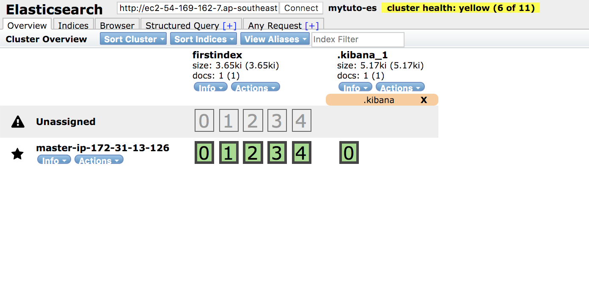

# ES-Tutorial-1

ElasticSearch 첫 번째 튜토리얼을 기술합니다.

본 스크립트는 외부 공인망을 기준으로 작성되었습니다.

## ElasticSearch Product 설치

이 튜토리얼에서는 rpm 파일을 이용하여 실습합니다.

Master Node 1번 장비에서 실습합니다.

```bash
[ec2-user@ip-xxx-xxx-xxx-xxx ~]$ sudo yum -y install git

[ec2-user@ip-xxx-xxx-xxx-xxx ~]$ git clone https://github.com/benjamin-btn/ES7-Tutorial.git

[ec2-user@ip-xxx-xxx-xxx-xxx ~]$ cd ES7-Tutorial/ES-Tutorial-1

[ec2-user@ip-xxx-xxx-xxx-xxx ES-Tutorial-1]$ ./tuto1

##################### Menu ##############
 $ ./tuto1 [Command]
#####################%%%%%%##############
         1 : elasticsearch packages
         2 : configure elasticsearch.yml & jvm.options
         3 : start elasticsearch process
         4 : install kibana packages
         5 : configure kibana.yml
         6 : start kibana process
         init : ec2 instance initializing
#########################################

```

## ELK Tutorial 1 - Elasticsearch, Kibana 세팅

### Elasticsearch
##### /etc/elasticsearch/elasticsearch.yml

1) cluster.name, node.name, network.host, http.cors.enabled, http.cors.allow-origin 추가설정
2) **./tuto1 1 ./tuto1 2 실행 후 cluster.name 은 unique name 으로 별도 설정 필요**
3) 7.x 부터 변경된 discovery 설정 추가

```bash
[ec2-user@ip-xxx-xxx-xxx-xxx ES-Tutorial-1]$ ./tuto1 1

[ec2-user@ip-xxx-xxx-xxx-xxx ES-Tutorial-1]$ ./tuto1 2

[ec2-user@ip-xxx-xxx-xxx-xxx ES-Tutorial-1]$ sudo vi /etc/elasticsearch/elasticsearch.yml


### For ClusterName & Node Name
cluster.name: mytuto-es # Your Unique Cluster Name
node.name: master-ip-172-31-14-110 # Your Unique Node Name

### For Head
http.cors.enabled: true
http.cors.allow-origin: "*"

### For Response by External Request
network.host: 0.0.0.0

### Discovery Settings
discovery.seed_hosts: [ "{IP1}:9300",  ]
cluster.initial_master_nodes: [ "{IP1}:9300",  ]

```

##### /etc/elasticsearch/jvm.options
3) Xms1g, Xmx1g 를 물리 메모리의 절반으로 수정

```bash
[ec2-user@ip-xxx-xxx-xxx-xxx ES-Tutorial-1]$ sudo vi /etc/elasticsearch/jvm.options

-Xms2g
-Xmx2g

```

4) 두 파일 모두 수정이 완료되었으면 ./tuto1 3 을 실행하여 ES 프로세스 시작, 클러스터가 잘 구성되었는지 확인

```bash
[ec2-user@ip-xxx-xxx-xxx-xxx ES-Tutorial-1]$ ./tuto1 3

```


### Kibana
/etc/kibana/kibana.yml
1) server.host 를 외부에서도 접근 가능하도록 0.0.0.0 으로 설정
2) elasticsearch.url 은 localhost 에 ES 도 함께 설치했기 때문에 http://localhost:9200 으로 설정
3) kibana.index 는 기본이름인 ".kibana" 로 설정

```bash
[ec2-user@ip-xxx-xxx-xxx-xxx ES-Tutorial-1]$ ./tuto1

##################### Menu ##############
 $ ./tuto1 [Command]
#####################%%%%%%##############
         1 : install java & elasticsearch packages
         2 : configure elasticsearch.yml & jvm.options
         3 : start elasticsearch process
         4 : install kibana packages
         5 : configure kibana.yml
         6 : start kibana process
         init : ec2 instance initializing
#########################################

[ec2-user@ip-xxx-xxx-xxx-xxx ES-Tutorial-1]$ ./tuto1 4

[ec2-user@ip-xxx-xxx-xxx-xxx ES-Tutorial-1]$ ./tuto1 5

[ec2-user@ip-xxx-xxx-xxx-xxx ES-Tutorial-1]$ ./tuto1 6

```

## Smoke Test

### Elasticsearch

```bash
[ec2-user@ip-xxx-xxx-xxx-xxx ES-Tutorial-1]$ curl localhost:9200
{
  "name" : "master-ip-172-31-13-126",
  "cluster_name" : "mytuto-es",
  "cluster_uuid" : "LTfRfk3KRLS31kQDROVu9A",
  "version" : {
    "number" : "7.3.0",
    "build_flavor" : "default",
    "build_type" : "rpm",
    "build_hash" : "a9861f4",
    "build_date" : "2019-01-24T11:27:09.439740Z",
    "build_snapshot" : false,
    "lucene_version" : "7.6.0",
    "minimum_wire_compatibility_version" : "5.6.0",
    "minimum_index_compatibility_version" : "5.0.0"
  },
  "tagline" : "You Know, for Search"
}

[ec2-user@ip-xxx-xxx-xxx-xxx ES-Tutorial-1]$ curl -H 'Content-Type: application/json' -XPOST localhost:9200/firstindex/_doc -d '{ "mykey": "myvalue" }'
```

* Web Browser 에 [http://ec2-52-221-155-168.ap-southeast-1.compute.amazonaws.com:9100/index.html?base_uri=http://{FQDN}:9200](http://ec2-52-221-155-168.ap-southeast-1.compute.amazonaws.com:9100/index.html?base_uri=http://FQDN:9200) 실행



### Kibana
* Web Browser 에 [http://{FQDN}:5601](http://{FQDN}:5601) 실행


## Trouble Shooting

### Elasticsearch
Smoke Test 가 진행되지 않을 때에는 elasticsearch.yml 파일에 기본으로 설정되어있는 로그 디렉토리의 로그를 살펴봅니다.

path.logs: /var/log/elasticsearch 로 설정되어 cluster.name 이 적용된 파일로 만들어 로깅됩니다.

위의 경우에는 /var/log/elasticsearch/mytuto-es.log 에서 확인할 수 있습니다.

```bash
[ec2-user@ip-xxx-xxx-xxx-xxx ES-Tutorial-1]$ sudo vi /var/log/elasticsearch/mytuto-es.log
```
  
